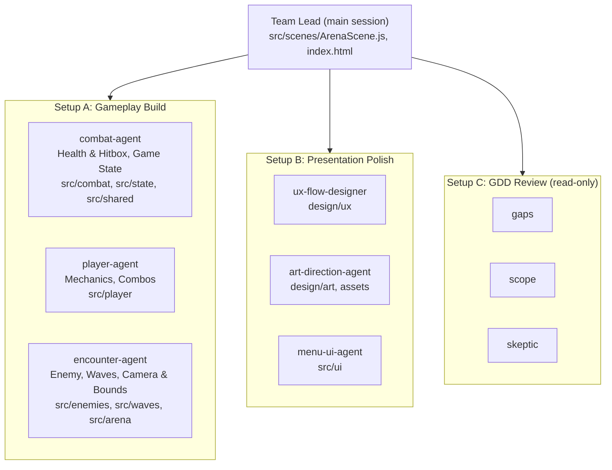
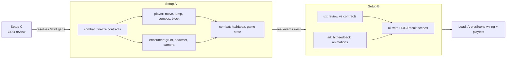
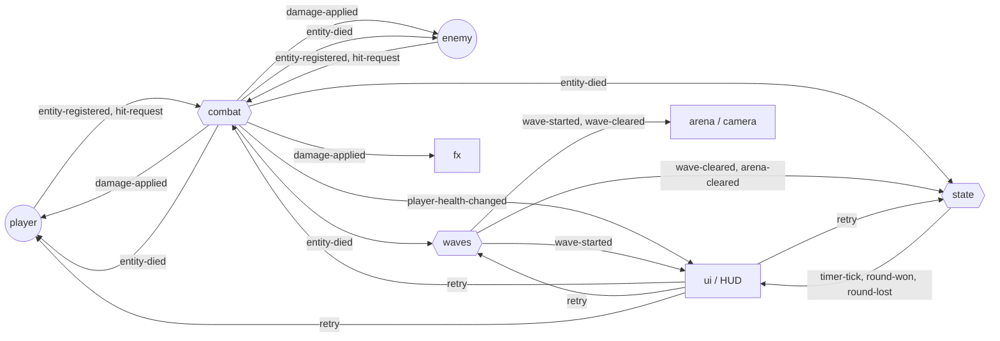
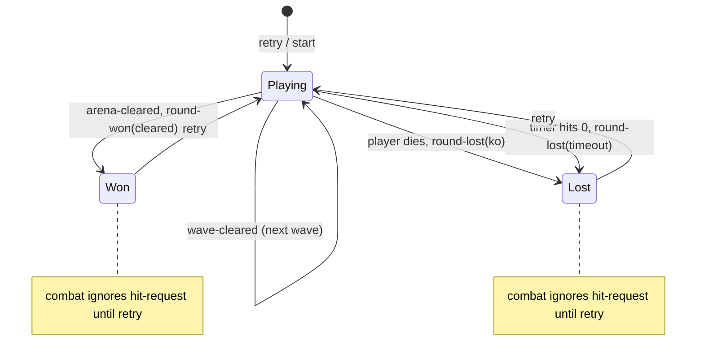
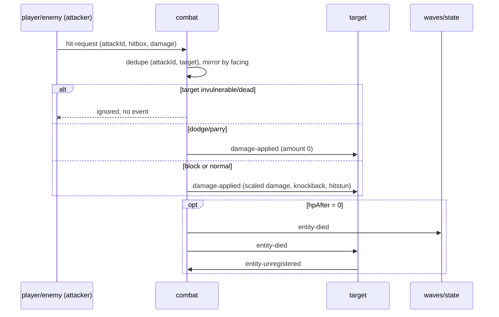
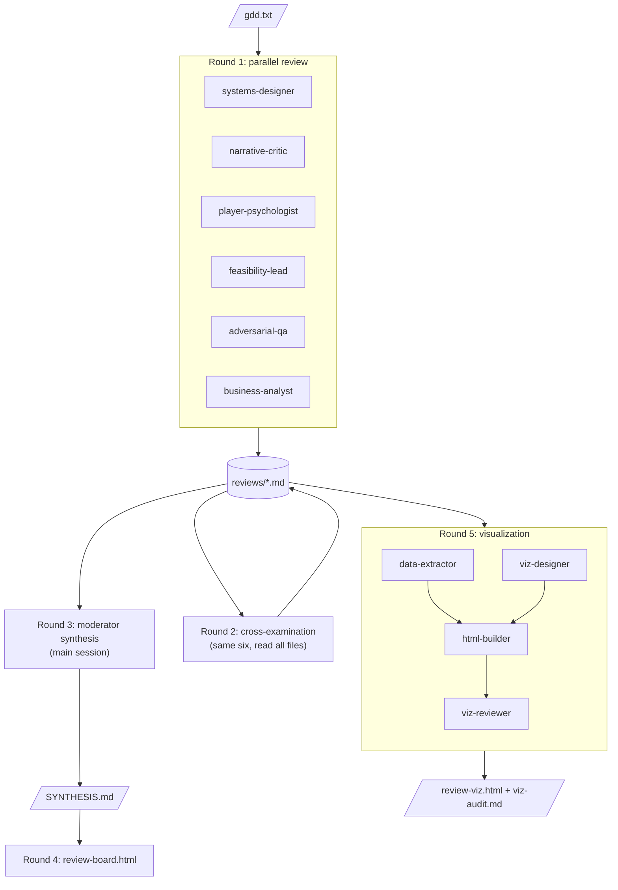

# Agent system diagrams (Mermaid)

Sources: `design/team/agent-team-setups.md`, `design/team/contracts.md`, `gdd-review-kit-main/`.

## 1. Agent roster and ownership

## 2. Dependencies and run order

## 3. Event contract (`game.events`)

## 4. Round lifecycle (game state)

## 5. Hit resolution sequence

## 6. GDD Review Kit pipeline (`gdd-review-kit-main`)

